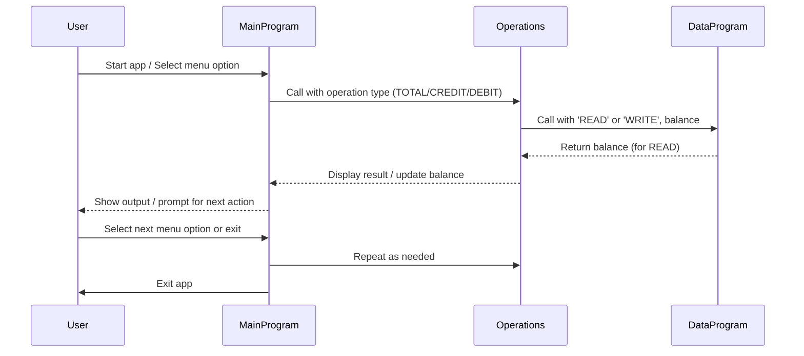

# COBOL Student Account Management System

This project demonstrates a simple student account management system written in COBOL. The system allows users to view their account balance, credit (deposit) funds, and debit (withdraw) funds, with basic business rules enforced for student accounts.

## Purpose of Each COBOL File

### main.cob
- **Purpose:** Entry point for the application. Handles user interaction and menu navigation.
- **Key Functions:**
  - Displays menu options: View Balance, Credit Account, Debit Account, Exit.
  - Accepts user input and calls the appropriate operation via the `Operations` program.
- **Business Rules:**
  - Only allows valid choices (1-4).
  - Exits gracefully when the user selects Exit.

### operations.cob
- **Purpose:** Implements the core account operations (view, credit, debit).
- **Key Functions:**
  - Receives operation type from `main.cob`.
  - For 'TOTAL', displays the current balance.
  - For 'CREDIT', accepts an amount, adds it to the balance, and updates storage.
  - For 'DEBIT', accepts an amount, checks for sufficient funds, subtracts it from the balance, and updates storage.
- **Business Rules:**
  - Debit operation checks for sufficient funds before allowing withdrawal.
  - Credit and debit operations update the balance via the `DataProgram`.

### data.cob
- **Purpose:** Manages persistent storage of the account balance.
- **Key Functions:**
  - For 'READ', returns the current stored balance.
  - For 'WRITE', updates the stored balance with the new value.
- **Business Rules:**
  - Initial balance is set to 1000.00.
  - Only allows reading and writing of the balance; no other operations.

## Specific Business Rules for Student Accounts
- **Initial Balance:** Every student account starts with a balance of 1000.00.
- **Debit Restrictions:** Students cannot debit more than their current balance (no overdraft allowed).
- **Credit/Debit Operations:** All changes to the balance are immediately persisted.
- **Menu Navigation:** Only valid menu options are accepted; invalid choices prompt the user to try again.

---

## Sequence Diagram: Data Flow

---

For further details, see the source files in `/src/cobol/`.
